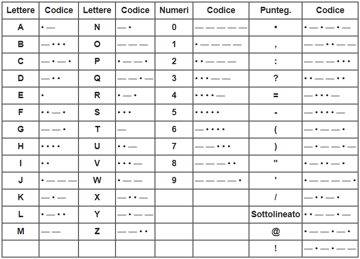

# Consegna:
> Trasmettitori di Gulliver

Le isole di Lilliput e Blefuscu sono ormai irrimediabilmente divise da una battaglia che dura da tantissimi anni. 
Ultimamente, poi, hanno deciso che non ci potranno più essere contatti verbali tra le popolazioni. 
Gli abitanti di Lilliput, però, vorrebbero almeno mantenere i rapporti diplomatici, hanno quindi proposto al governo di Blefuscu di poter trasmettere i propri messaggi utilizzando il codice morse. 
Inizialmente contrari, i blefuschiani hanno ora accettato solamente di ricevere i messaggi dei lillipuziani. 
Hai ricevuto il compito di realizzare la stazione che trasmetterà i messaggi / che riceverà i messaggi e dopo potrai effettuare un test con il tecnico dell'isola avversaria senza parlare! Il Re è stato chiaro, nessun contatto verbale altrimenti sarai imprigionato a vita. 
Un tecnico al di sopra delle parti ha scritto il seguente capitolato tecnico al quale perfettamente attenersi pena il non funzionamento dell'apparato. 

Capitolato tecnico. 
Dispositivo di LILLIPUT. 
1 Arduino UNO 
1 LED bianco (PIN 13 utilizzando il resistore di Arduino) 

Dispositivo di BLEFUSCU. 
1 Arduino UNO 
1 sensore LUCE (PIN A5); 
1 LED rosso (PIN 13 utilizzando il resistore di Arduino) 

Elementi in comune. 
1 cannuccia di colore nero 

Regole di trasmissione/ricezione
La parola "SOS" nel codice morse si scrive ". . . - - - . . ." (Tre punti, tre linee, tre punti), si decide di stabilire: 
"start character" non presente; 
"." un'accensione luminosa del led di circa mezzo secondo; 
"-" un'accensione luminosa del led di circa un secondo; 
il tempo di "stacco" tra un segnale luminoso e l'altro è di circa 3/10 di secondo; 
"end character" un'accensione luminosa del led di circa due secondi. 
Il carattere PUNTO (in codice morse) termina la trasmissione. 
Ala fine della trasmissione il dispositivo di BLEFUSCU emette per 3 volte un segnale rosso luminoso intermittente da 1 secondo. 
I simboli sono trasmessi premendo sulla tastiera LILLIPUT il carattere/testo desiderato. 

Entrambi i dispositivi, una volta inviato o ricevuto il carattere/teso, lo memorizzeranno in una lista semplice linkata carattere per carattere e, alla fine della trasmissione, il testo ricevuto sarà visualizzato da entrambi i dispositivi in console.  

  

